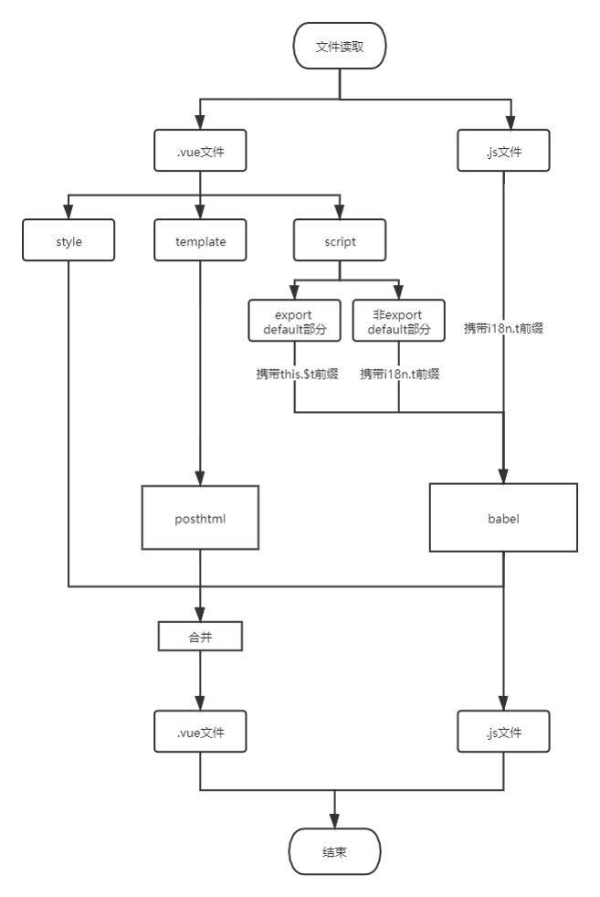

## `vue` `i18n-collect`工具开发

老项目引入`i18n`国际化后，需要对项目中所有中文包裹`$t('中文')`方法，对象不同，包裹的方法也有差异：

1. 在`vue`的`template`中，直接对中文包裹`$t('中文')`
2. 在`vue`的组件代码中，由于`$t`是全局引入，因此需包裹成`this.$t('中文')`
3. 对于纯`js`部分，需import `i18n`模块，并对中文包裹`i18n.t('中文')`
4. 对于带数字的字符串，如【`共计${count}条数据`】，需转换为`$t('共计count条数据', {count: 100})`的结构，转换前的代码在不同地方可能有不一样的表示，比如在`vue`的`template`中，转换前的词条可能是这样：【`共计{{count}}条数据`】

### 问题分析

面对此类问题，首先想到的自然是将代码转换成`ast`树，对其中的中文字符串进行处理，再转换为代码，但实际会遇到以下几个问题：

1. 一般的parser（如`@bable/parser`）只能处理`js`或`jsx`文件，无法处理`vue`模板，利用`vue-loader`将`.vue`文件转换成`.js`文件虽然可以配合`@bable/parser`进行解析，但转换成`.js`文件后的代码，没有相关的转换器将其反过来转换成`.vue`代码，这和我们的需求不符
2. 即使有`.vue`文件的parser（如`vue-eslint-parser`），但是没有对应的traverse和generator工具，不能将解析的`ast`反过来转换成代码
3. 即使有`.vue`文件的parser、traverse、generator配套工具，重新生成的`vue`代码格式很大概率无法满足`eslint`校验，需要自动进行格式修正

### 解决思路

通过对当前问题的分析，目前面临的问题有两个：

1. 需要有`.vue`文件配套的解析、生成工具
2. 解决转换后代码的`eslint`格式问题

问题2可以通过在生成处理后的`.vue`文件时，运行项目中的`eslint --fix`命令实现，若项目不校验格式，自然不会安装`eslint`，但若校验格式，则必定会安装`eslint`，也就是可以执行`eslint --fix`命令。

当前主要矛盾是问题1，而观察问题1，`.vue`文件中`js`文件有配套的转换工具，主要矛盾集中在`template`上，而目前虽然没有`template`的生成工具，但可以将其视作`html`解析，`template`特性的解析作为`html parser`的插件完成。



### 用法

````txt
npm i git+https://github.com/goblin-pitcher/i18n-collector.git -D
---------------------------------
npx i18n-collect
````

#### 参数

| 参数名      | 简写 | 说明                                                         |                  默认值                  |
| ----------- | ---- | ------------------------------------------------------------ | :--------------------------------------: |
| `dir`       | d    | 需要进行国际化处理的目录                                     |                    ./                    |
| `ignoredir` | i    | 需要忽略的文件或者文件夹 如 -i car.js 会忽略掉所有以 `car.js`结尾的文件 | 无论传不传此参数，都会忽略掉`i18n`文件夹 |
| `fix`       | f    | 运行完collect之后是否自动执行eslint --fix, 默认开启，--fix false即关闭eslint执行 |                   true                   |

#### 配置

新建`i18n-collect.config.js`文件可传入具体配置，默认配置如下：

````javascript
const defConfig = {
  // 转换当前目录下的文件
  dir: './',
  // 忽略项
  ignoredir: [],
  // 是否执行eslint --fix
  fix: true,
  // 收集中文词条的文件名
  output: 'zh-CN.js',
  // 文件处理配置
  file: {
    // 模板中包裹中文的函数名，如$t('中文')
    template: { prefix: "$t" },
    // 对于纯js文件的处理
    js: {
      // 若有中文词条需要提取，需要先引入i18n相关包才能包裹，该配置为添加引入文件的配置
      // 默认引入时添加 import {i18n} from '@/utils/i18n.utils'
      addImport: {
        from: "@/utils/i18n.utils",
        data: ["i18n"],
      },
      // 包裹中文词条的方法，如i18n.t('中文')
      prefix: "i18n.t",
    },
    // .vue文件中script包裹中文的方法, 如this.$t('中文')
    // 遇到sparePrefix配置，即i18n.t（'中文'）的字段，也会当作已包裹转换方法的字符串，而不会再用this.$t包裹一次
    vue: { prefix: "this.$t", sparePrefix: 'i18n.t' }
  }
};
````

